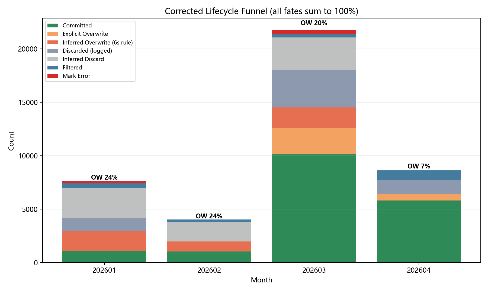
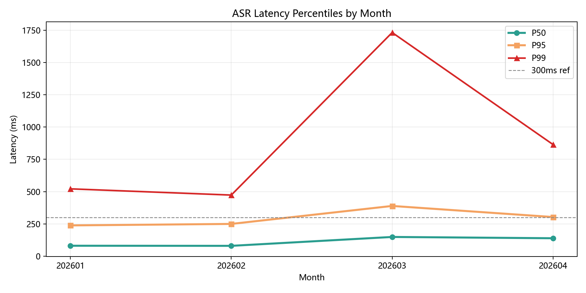
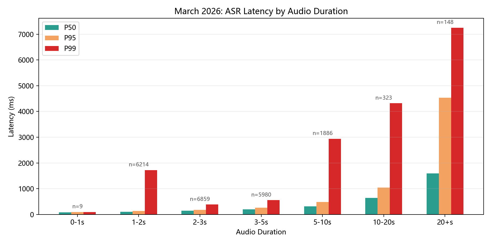
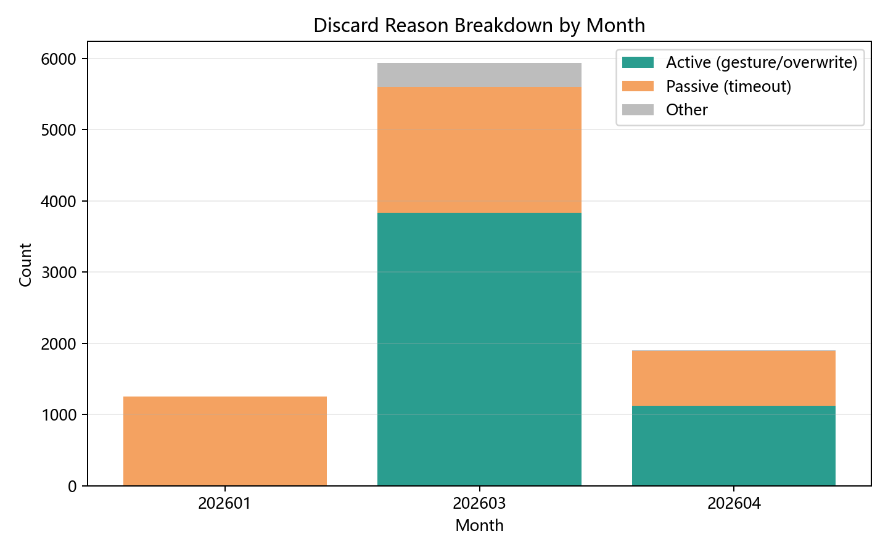
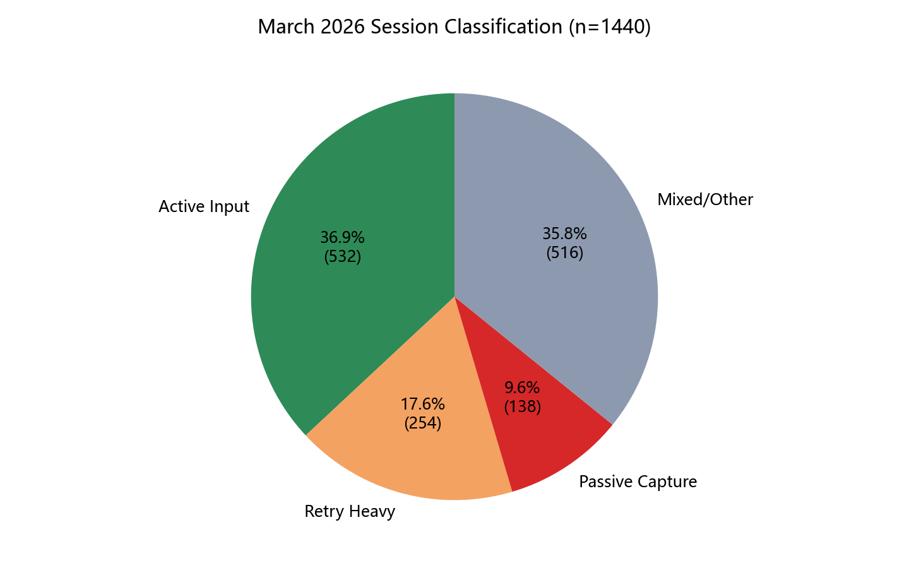
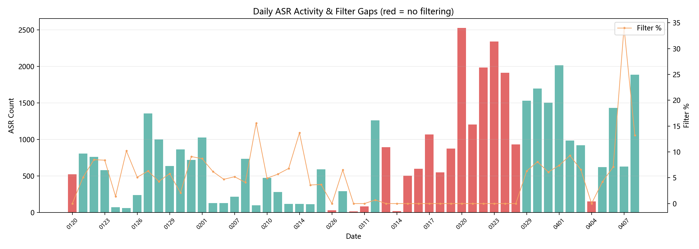

# 使用行为分析

本文档关注的不是“模型离线 benchmark”，而是产品在真实使用过程中的行为数据：用户到底有没有提交、为什么放弃、在哪些时段最常用、什么时候系统会失灵。

## 数据概况

- 42,000+ 条语音事件
- 45,537 个音频文件，约 509 MB
- 分析区间：2026 年 1-4 月
- 关键命运标签：committed / overwrite / discarded / filtered / mark_error

## 生命周期漏斗

| 月份 | 总量 | 提交率 | 覆写率 | 丢弃率 | 拦截率 | 提交字数 |
|------|------|--------|--------|--------|--------|---------|
| 1月 | 7,604 | 14.6% | 24.0% | 53.2% | 5.5% | 14,866 |
| 2月 | 4,042 | 25.6% | 23.5% | 44.8% | 6.1% | 14,175 |
| 3月 | 21,772 | 46.5% | 20.2% | 30.0% | 1.6% | 118,526 |
| 4月 | 8,630 | 67.4% | 6.9% | 15.3% | 10.4% | 73,948 |

结论：

1. 提交率从 14.6% 提升到 67.4%，说明工具从“能用”变成了“值得持续用”。
2. 覆写率从 24.0% 降到 6.9%，除了交互和过滤策略改善，另一个可能的因素是用户自身的口头表达也在变得更流畅——长期使用语音输入会不自觉地训练人在开口前组织好完整句子，减少磕碰和重复。这可能是语音输入工具带来的一个意外收益。
3. 丢弃率下降说明中间态交互和过滤策略更有效了。

## 延迟表现

| 月份 | P50 | P95 | P99 |
|------|-----|-----|-----|
| 1月 | 81ms | 238ms | 521ms |
| 2月 | 80ms | 250ms | 473ms |
| 3月 | 149ms | 389ms | 1,731ms |
| 4月 | 139ms | 303ms | 864ms |

洞察：

- P50 长期保持在 150ms 内，说明本地主链路足够快。
- 3 月 P99 异常上升，是长录音和环境被动捕获导致的尾部问题，不是平均性能退化。

## 丢弃和过滤

产品中的过滤规则目前主要覆盖：

- 语气词和口头禅
- 过短文本
- 纯标点内容

这些规则的目的不是“让指标好看”，而是直接减少无意义注入。日志也说明，很多失败样本并不值得送进编辑框，它们应该在前面就被拦住。

## 会话行为

以 90 秒间隔切分后，共识别出 1,440 个使用会话，主要分为：

- Active Input：正常高效输入
- Retry Heavy：频繁重说，说明识别或表达不满意
- Passive Capture：环境音频被误捕获

这类分析的价值在于，它不只告诉我们“错了多少”，还告诉我们“用户是怎么和错误相处的”。

## 运维事故回溯

通过每日拦截统计，反查出 3/5-3/28 共 17 天过滤配置失效。恢复后拦截率重新回到约 10%。

这说明一个重要事实：

- 结构化日志不仅能做评测，也能做线上问题定位。
- 没有日志时，用户只能模糊感知“最近变差了”；有日志时，可以准确定位是哪条配置、哪段时间、哪类失败出了问题。

## 其他图表

- [figures/app_distribution.png](figures/app_distribution.png)：使用场景分布，代码开发占比最高
- [figures/hourly_distribution.png](figures/hourly_distribution.png)：使用峰值集中在白天工作时段
- [figures/text_length_fate.png](figures/text_length_fate.png)：9-16 字符的提交率最高
- [figures/retry_patterns.png](figures/retry_patterns.png)：显式重说链和连续返工行为

## 产品侧结论

1. 真正推动提交率提升的，不是单一模型换代，而是交互、过滤、反馈链路一起改善。
2. 语音输入工具必须接受一个现实：不是每条语音都值得提交，过滤是产品能力的一部分。
3. `mark_error` 和 overwrite 不是噪声，它们是最有价值的 badcase 来源。
4. 行为日志和模型评测应该共用一套数据口径，否则很难形成稳定闭环。