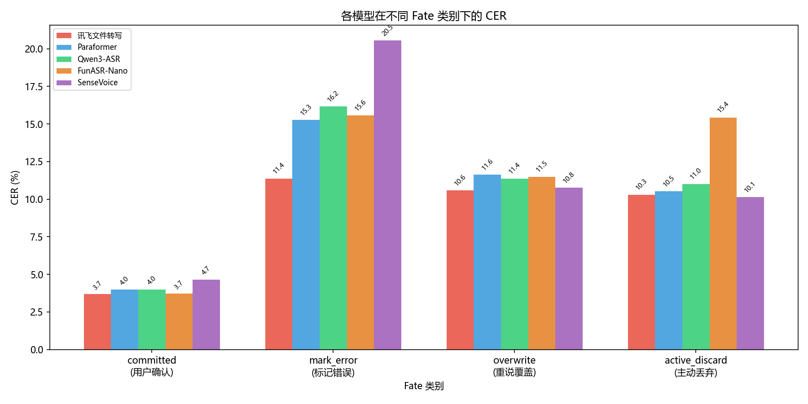
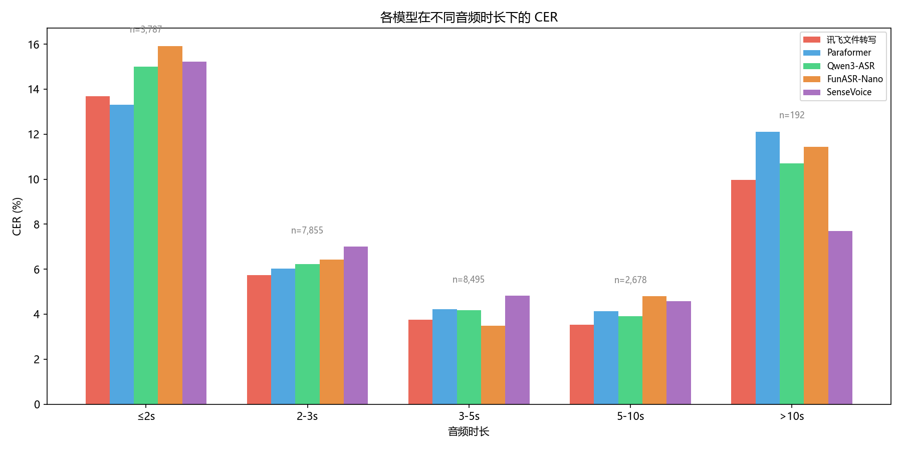
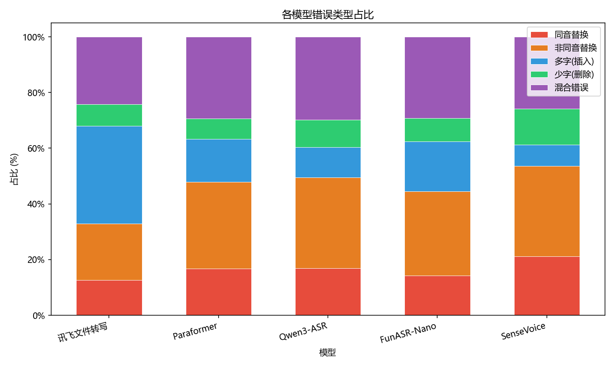
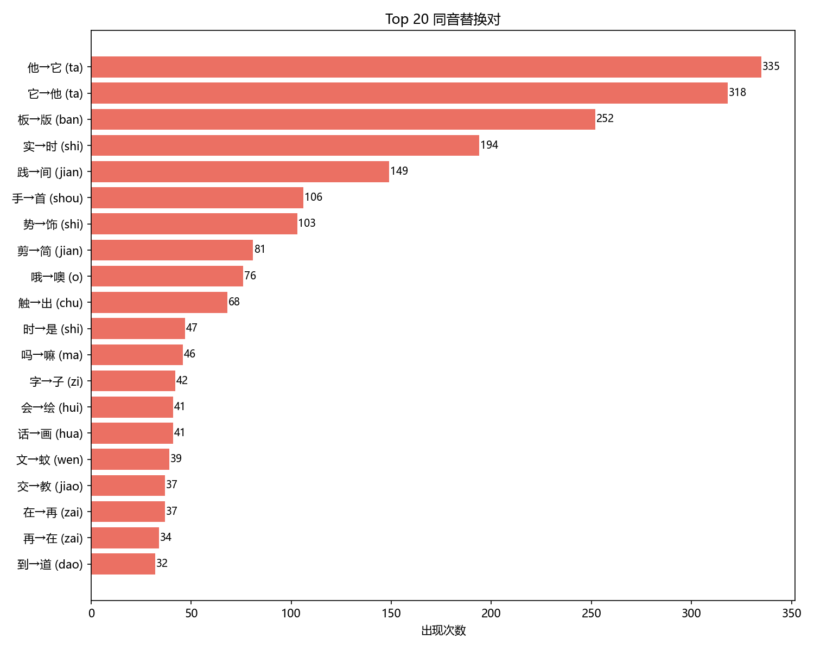

# ASR 多模型横评

本文档记录 VoiceInput 真实语音数据上的 5 模型系统评测结果。

## 评测范围

- 数据集规模：23,846 条 / 30.5 小时
- 有效标注：23,043 条 ground truth
- 有效评测样本：23,007 条
- 场景覆盖：committed / mark_error / overwrite / active_discard
- 评测模型：SenseVoice-Small（228MB, CPU）、FunASR-Nano（948MB, GPU）、Paraformer-Large（848MB, CPU）、Qwen3-ASR（895MB, GPU）、讯飞文件转写（云端）

## 标注体系

| 标注来源 | 数量 | 方法 |
|---------|------|------|
| 人工 UI 标注 | 2,079 | 逐条审核 |
| 自动标注 | 5,649 | 5 模型多数投票一致 / 标点差异自动合并 |
| AI 辅助标注 | 15,315 | DeepSeek few-shot + 双向上下文 |
| 合计 | 23,043 | Ground Truth 覆盖率 96.6% |

AI 标注调优结论：

- deepseek-chat 一致性最好，kappa 约 0.79
- 25-shot 优于更少或更多示例
- 前文 120s/8 条 + 后文 60s/8 条的上下文窗口效果最好
- 最终整体一致性约 kappa = 0.80

## 总体结果

| 模型 | 模型大小 | 推理设备 | 架构 | CER | 精确匹配率 | 总错误 | P50 延迟 | P95 延迟 | RTF‡ |
|------|---------|---------|------|-----|-----------|--------|----------|----------|------|
| SenseVoice-Small | 228 MB | CPU (ONNX) | 非自回归 | 6.09% | 67.4% | 7,495 | 145ms§ | 309ms§ | 0.053 |
| Paraformer-Large | 228 MB | CPU (ONNX) | 非自回归 | 5.61% | 72.6% | 6,245 | 170ms | 305ms | 0.058 |
| FunASR-Nano | 948 MB | GPU (INT8) | 自回归 | 5.64% | 76.9% | 5,324 | 217ms | 465ms | 0.073 |
| Qwen3-ASR | 895 MB | GPU (INT8) | 自回归 | 5.59% | 73.5% | 6,098 | 270ms | 588ms | 0.093 |
| 讯飞文件转写 | 云端 | 云端 API | - | 5.09% | 71.9% | 6,457 | 9,095ms | 31,301ms | 3.15 |

> † Paraformer-Large 同时验证了未量化 PyTorch 版本（848MB，CER 5.55%）和 ONNX INT8 量化版（228MB，CER 5.61%）。全量 23,005 条评测中量化损失仅 +0.06%，表中结果基于 ONNX 量化版。延迟基于单线程 PyTorch 版评测，两者延迟一致。
>
> ‡ RTF（Real-Time Factor）= 逐条计算推理耗时/音频时长后取中位数，值越小越快。
>
> § SenseVoice-Small 的延迟数据来自生产环境日志（在同一评测集上的 23,760 条记录），其余模型为离线批量评测。

结论：

1. 讯飞精度最好，但云端延迟对实时桌面输入不可接受。
2. Paraformer-Large 是当前本地链路的最好平衡点——跑在 CPU 上，延迟和精度均优于 GPU 上的 Qwen3-ASR 和 FunASR-Nano。
3. Qwen3-ASR 和 FunASR-Nano 这类自回归模型在 GPU 上运行，并没有换来足够大的精度优势，却付出了更高延迟和 GPU 资源开销。
4. FunASR-Nano 的平均指标不差，但存在极端重复幻觉 badcase。

## INT8 量化对比

Paraformer-Large 同时评测了 PyTorch 原版（848MB）和 ONNX INT8 量化版（228MB），全量 23,005 条结果如下：

| 版本 | 模型大小 | CER | 精确匹配率 |
|------|---------|-----|----------|
| PyTorch（原版） | 848 MB | 5.55% | 72.9% |
| ONNX INT8（量化） | 228 MB | 5.61% | 72.6% |
| **差异** | **-73%** | **+0.06%** | **-0.3%** |

逐条对比（23,005 条）：

| | 条数 | 占比 |
|------|------|------|
| ONNX 更好 | 371 | 1.6% |
| ONNX 更差 | 476 | 2.1% |
| 完全一致 | 22,158 | 96.3% |

结论：INT8 量化将模型体积压缩 73%，CER 仅增加 0.06%，96.3% 的样本结果完全一致。对于桌面端部署，量化版是更务实的选择。

## 按场景拆分

| fate | 条数 | 讯飞 | Paraformer | Qwen3 | FunASR | SenseVoice |
|------|------|------|-----------|-------|--------|-----------|
| committed | 18,198 | 3.69% | 3.99% | 4.00% | 3.71% | 4.65% |
| mark_error | 593 | 11.38% | 15.27% | 16.16% | 15.57% | 20.55% |
| overwrite | 2,457 | 10.58% | 11.63% | 11.38% | 11.50% | 10.77% |
| active_discard | 1,759 | 10.29% | 10.52% | 11.02% | 15.43% | 10.16% |

洞察：

- `mark_error` 是最能拉开差距的难样本区。
- 讯飞在难 case 上领先最明显，但仍不适合主交互链路。
- FunASR-Nano 在主动放弃样本上明显吃亏，说明其失败样本更容易让用户失去信心。

## 按时长拆分

| 时长 | 讯飞 | Paraformer | Qwen3 | FunASR | SenseVoice | 样本 |
|------|------|-----------|-------|--------|-----------|------|
| <=2s | 13.7% | 13.3% | 15.0% | 15.9% | 15.3% | 3,787 |
| 2-3s | 5.8% | 6.0% | 6.2% | 6.5% | 7.0% | 7,855 |
| 3-5s | 3.7% | 4.2% | 4.2% | 3.5% | 4.8% | 8,495 |
| 5-10s | 3.5% | 4.1% | 3.9% | 4.8% | 4.5% | 2,678 |
| >10s | 10.0% | 12.1% | 10.7% | 11.4% | 7.7% | 192 |

最有价值的结论：

- 短语音不是简单任务，反而是所有模型共同的薄弱点。
- 3-5 秒是当前桌面输入场景下最稳的时长区间。
- 这直接导出产品建议：尽量说成完整短句，而不是只说一个词。

## 错误类型聚类

对 31,619 条错误记录做编辑操作分析，分为 5 类：

| 错误类型 | 数量 | 占比 | 说明 |
|---------|------|------|------|
| 非同音替换 | 9,285 | 29.4% | 语素级误映射 |
| 混合错误 | 8,711 | 27.5% | 多种错误叠加 |
| 多字 | 5,422 | 17.1% | 插入型错误 |
| 同音替换 | 5,236 | 16.6% | 拼音相同但字不同 |
| 少字 | 2,965 | 9.4% | 删除型错误 |

## Top 同音替换

| 替换对 | 次数 | 说明 |
|--------|------|------|
| 他 <-> 它 | 653 | 代码注释、普通叙述均高频出现 |
| 板 -> 版 | 252 | 模板 / 版本等开发场景常见 |
| 实 -> 时 | 194 | 实时等领域词 |
| 践 -> 间 | 149 | 实践 / 时间混淆 |
| 手 -> 首 | 106 | 手势相关词 |

这里最关键的不是“知道错在哪里”，而是把高频错误直接写回产品配置。像 会画 -> 会话、首饰 -> 手势、时件 -> 实践 这类替换已经进入词表，开始在真实链路中发挥作用。

## 模型侧结论

| 模型 | 结论 |
|------|------|
| Paraformer-Large（228MB, CPU） | 当前本地主链路最优解，ONNX INT8 量化后与 SenseVoice 同体积，精度和延迟最平衡，CPU 推理即可 |
| Qwen3-ASR（895MB, GPU） | 自回归解码在 GPU 上运行，代价明显，实时交互收益不足 |
| FunASR-Nano（948MB, GPU） | 自回归架构（SenseVoice Encoder + LLM 解码器），平均分不错，但要警惕重复幻觉和极端坏例 |
| SenseVoice-Small（228MB, CPU） | 当前在线版本，轻量但对同音替换和少字更敏感 |
| 讯飞文件转写 | 可作为精度上界参考，不适合作为实时输入主路径 |

## 可公开数据

- [data/model_summary.csv](data/model_summary.csv)
- [data/per_fate_cer.csv](data/per_fate_cer.csv)
- [data/per_duration_cer.csv](data/per_duration_cer.csv)
- [data/cer_matrix.csv](data/cer_matrix.csv)
- [data/key_metrics.json](data/key_metrics.json)