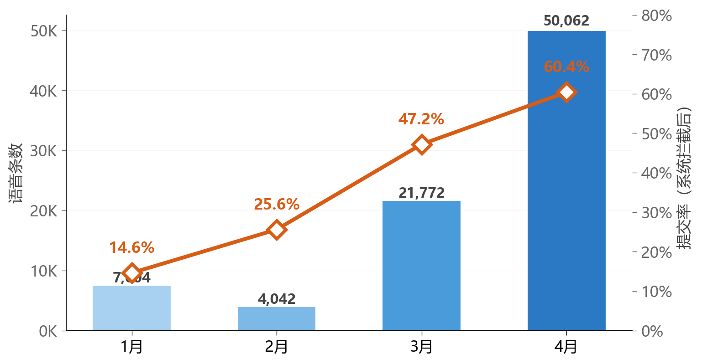
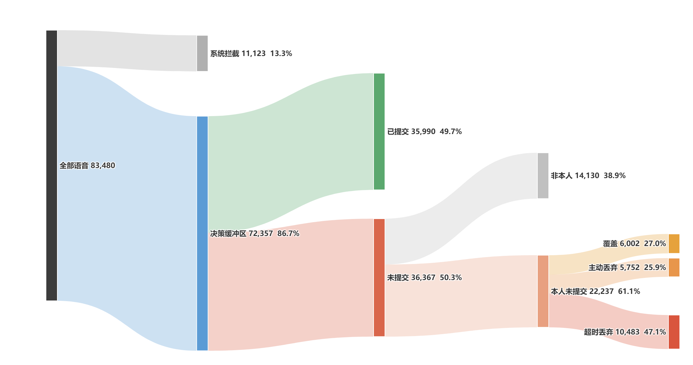
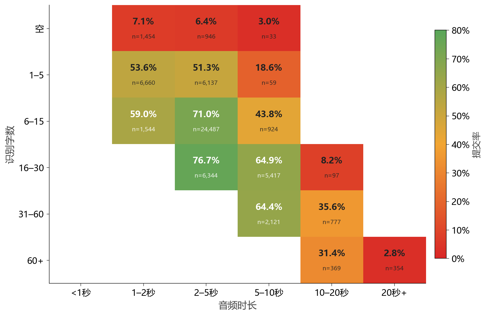

# 近 50 万字常开麦语音输入实测

**83,480** 条语音事件 &nbsp;·&nbsp; **35,990** 句提交（43.1%） &nbsp;·&nbsp; **近 50 万字** 输入

<h3>不按键说话，不直接上屏；先生成草稿，确认后写入</h3>

2026 年 1–4 月真实使用数据

---

这是一个桌面语音输入工具：麦克风保持开启，说话先变成草稿，不直接写进应用。用户确认才写入；说错了可以用下一句覆盖。

| 能力 | 数据 |
|---|---:|
| 常开麦采集 | 83,480 条语音事件 |
| 有效写入 | 35,990 句提交（43.1%），494,925 字输入 |
| 噪声过滤 | 11,123 条系统拦截（13.3%） |
| 草稿缓冲 | 72,357 条进入缓冲区（86.7%），36,367 条未提交（50.3%） |
| 说错重说 | 6,002 条覆盖；1,586 个多次修改后提交 session（6.5%） |
| 表达方式影响成功率 | 2–5 秒、6–30 字提交率 71.0%–76.7% |

---

## 1. 日常使用规模

1–4 月累计 83,480 条语音、35,990 句提交（43.1%）、494,925 字输入。月度变化见下图。

  

---

## 2. 从语音到写入应用

83,480 条语音里，35,990 句最终写入应用（43.1%）；缓冲区挡住了大量不该提交的内容。

  

---

## 3. 说错了可以重说

本人未提交里有 6,002 条覆盖；多次修改后提交平均 3.1 条语音。缓冲区吸收了反悔、改口和重说。

| 行为 | 数量 |
|---|---:|
| 覆盖 | 6,002 |
| 主动丢弃/标错 | 5,752 |
| 超时丢弃 | 10,483 |
| 一次提交 | 22,693（93.5%） |
| 多次修改后提交 | 1,586（6.5%） |

---

## 4. 表达方式影响成功率

最稳的不是蹦词，也不是长篇口述，而是 2–5 秒、6–30 字的完整短句。

  

---

## 保留内容：多模型评测

旧仓库里的行为分析口径已归档，主页以本报告为准。多模型 ASR 横评仍然保留，见 [EVALUATION.md](EVALUATION.md)。

---

*工具本体暂未开源；数据分析方法和结论公开。*