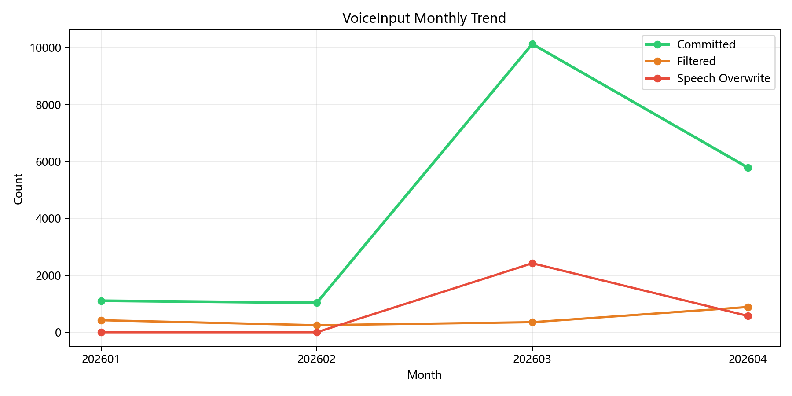
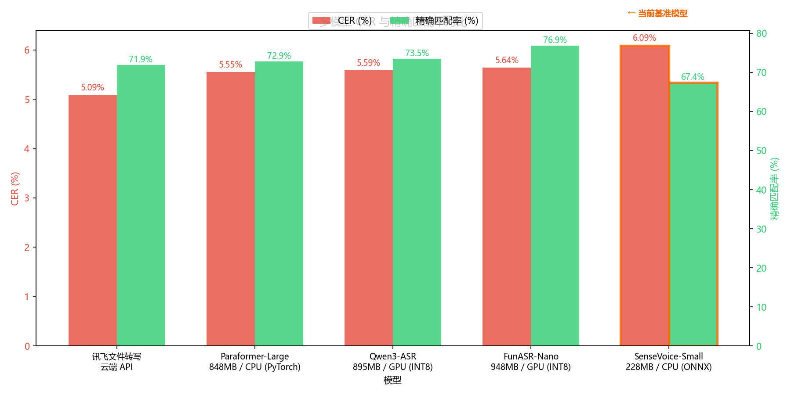
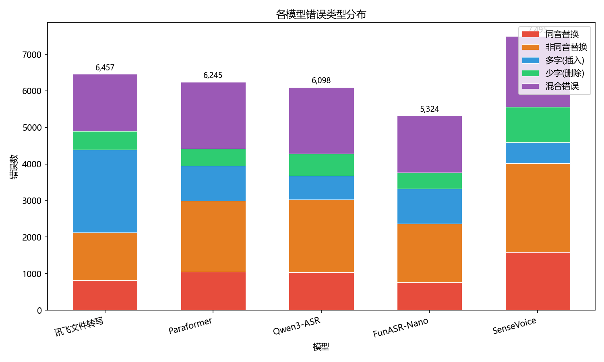

# VoiceInput

真实语音数据驱动的桌面语音输入工具。自用 4 个月，积累 42,000+ 条语音事件后做的系统复盘。

---

## 项目背景与动机

VoiceInput 是一个自研的 Windows 桌面语音输入工具，解决的是桌面语音输入长期存在的几个问题：说完即注入无法确认、跨应用割裂、错字返工成本高、开发场景中英混输体验差。

但语音输入只是第一步。系统从一开始就集成了 AI Agent 的调用入口——语音不仅是文本输入的通道，也是未来 Agent 交互的自然接口。当前版本主要在输入侧做了深度分析和优化；Agent 侧的行为追踪和质量分析是下一阶段的方向。

这个仓库记录的是：用了 4 个月、累计提交超过 22 万字之后，我从数据里看到了什么，做了什么调整，接下来打算做什么。

## 核心数据一览

4 个月提交率从 14.6% 提升到 67.4%，覆写率从 24.0% 降到 6.9%。不是换了模型，而是交互设计、过滤规则、替换词表一起在迭代。覆写率的大幅下降还有另一层含义：随着长期使用语音输入，我自己的口头表达也在变得更流畅——开口前会自觉地组织完整句子，而不是想到哪说到哪。这可能是语音输入工具带来的一个意外收益。

5 个 ASR 模型在 23,846 条 / 30.5 小时真实语音上的横评。SenseVoice-Small 和 Paraformer-Large 均跑在 CPU 上，其中 Paraformer 的 CER 与 GPU 上的两个自回归模型几乎持平。

31,619 条错误记录的类型分布。同音替换占 16.6%，这部分可以直接用替换词表兜住。

## 5 模型横评摘要

当前在线运行的是 SenseVoice-Small（228MB，ONNX INT8，CPU），是一个轻量级版本。

| 模型 | 模型大小 | 推理设备 | 架构 | CER | 精确匹配 | P50 延迟 | RTF‡ |
|------|---------|---------|------|-----|---------|---------|------|
| SenseVoice-Small | 228 MB | CPU (ONNX) | 非自回归 | 6.09% | 67.4% | 145ms§ | 0.053 |
| **Paraformer-Large** | **228 MB** | **CPU (ONNX)** | **非自回归** | **5.61%** | **72.6%** | **170ms** | **0.058** |
| FunASR-Nano | 948 MB | GPU (INT8) | 自回归 | 5.64% | 76.9% | 217ms | 0.073 |
| Qwen3-ASR | 895 MB | GPU (INT8) | 自回归 | 5.59% | 73.5% | 270ms | 0.093 |
| 讯飞文件转写 | 云端 | 云端 API | - | 5.09% | 71.9% | 9,095ms | 3.15 |

> † Paraformer-Large 同时验证了未量化 PyTorch 版本（848MB，CER 5.55%）和 ONNX INT8 量化版（228MB，CER 5.61%）。全量 23,005 条评测中量化损失仅 +0.06%，表中结果基于 ONNX 量化版。延迟基于单线程 PyTorch 版评测，两者延迟一致。
>
> ‡ RTF（Real-Time Factor）= 逐条计算推理耗时/音频时长后取中位数，值越小越快。
>
> § SenseVoice-Small 的延迟数据来自生产环境日志（在同一评测集上的 23,760 条记录），其余模型为离线批量评测。

**Paraformer-Large 量化对比**（23,005 条全量评测）：

| 版本 | 模型大小 | CER | 精确匹配率 |
|------|---------|-----|----------|
| PyTorch 原版 | 848 MB | 5.55% | 72.9% |
| ONNX INT8 量化 | 228 MB | 5.61% | 72.6% |

体积压缩 73%，CER 仅 +0.06%，96.3% 的样本结果完全一致。

几个值得注意的点：

- Paraformer-Large 跑在 CPU 上，延迟和精度都优于 GPU 上的 Qwen3-ASR 和 FunASR-Nano（两者均为自回归架构）。自回归解码在这个场景下性价比不高。
- 讯飞精度最好但延迟不可接受，只能作为离线标注参考。
- FunASR-Nano 精确匹配率最高，但存在极端重复幻觉的风险。

详细对比见 [EVALUATION.md](EVALUATION.md)。

## 数据回灌产品的实际例子

评测不只是出报告。发现的高频同音替换直接写进了产品运行时的替换词表：

- 会画 -> 会话、首饰 / 手饰 / 首势 -> 手势、时件 -> 实践
- 玄浮框 -> 悬浮框、数据买点 -> 数据埋点、精因 -> 静音

这些规则在每天的实际使用中持续生效。日志中可以观察到同类错误的出现频率是否下降。

## 从数据里总结出的使用经验

### 短文本识别率显著更低

根据时长和字符数两个维度交叉分析：

| 时长区间 | 对应字符数（约） | CER 范围 | 提交率 |
|---------|-------------|---------|-------|
| ≤2s | ≤4 字符 | 13–16% | 24% |
| 2–3s | 5–8 字符 | 5.8–7.0% | 52% |
| 3–5s | 9–16 字符 | 3.5–4.8% | 63% |
| 5–10s | 17–32 字符 | 3.5–4.8% | 57% |

短语音（≤2 秒 / ≤4 字符）是所有模型共同的薄弱点，3–5 秒 / 9–16 字符的完整短句是识别率最稳的区间。

实际使用中的应对方式：

- 输入一个专业词时，把它放进一个上下文短句里说出来，而不是只蹦一个词
- 比如要输入"手势"，实际会说"这个功能叫手势控制"；要输入"实践"，会说"这是项目里的实践"
- 这样做不仅提高识别率，也给 AI 纠错提供了更多上下文

### 幻觉和重复是实际风险

评测中出现过 FunASR-Nano 重复输出"日日日日日..."（CER 372%）的极端 badcase。产品链路中已经覆盖了短文本过滤、语气词拦截、纯标点过滤等规则来兜底。后续换模型时，hallucination risk 是优先级高于平均 CER 的选型因素。

### 日志能发现隐性故障

行为分析反查出 3/5-3/28 共 17 天过滤配置失效（拦截率从 ~10% 降到 0）。没有埋点的话这类问题只会被感知为"最近好像变差了"，无法定位。

## 与座舱场景的共性（个人观察）

做桌面语音输入的过程中，偶然发现很多问题和智能座舱语音交互高度重叠：

- **注意力受限**：桌面场景中用户边看屏幕边说话，座舱中驾驶员边开车边下指令，都不是"专注朗读"的理想条件。
- **噪声干扰**：本项目中的背景环境噪声、呼吸声、认知停顿，直接对应座舱中的路噪、风噪、乘客交谈。系统的 `filter_reason` 噪声分类体系可迁移。
- **短指令是共同薄弱点**：≤2 秒 / ≤4 字符的短指令 CER 13–16%，所有模型都差。这也是唤醒词普遍设计为 3–4 音节（"小爱同学""你好小P"）的底层原因——音节太少时声学特征不足以可靠区分。座舱中"播放""暂停""返回"等 2 字指令如果脱离唤醒词单独识别（免唤醒模式），就直接面临这个短音频困境；而"小爱同学播放音乐"连说时整句足够长，识别率自然上来。唤醒词在这里客观上也充当了为短指令补充声学上下文的角色。
- **实时性要求**：桌面输入需要亚秒级响应避免打断思路，座舱交互对延迟要求更严格。
- **评测方法可迁移**：多模型横评、错误类型聚类、场景分层下钻、badcase 归因的整套方法论不依赖特定硬件平台。

## 工具能力概要

核心交互：

- 全局跨应用语音输入（VS Code、浏览器、微信、Word 等）
- 预览后再确认提交，避免误注入
- 多段语音聚合和逐条重说替换
- 可配置替换词表（评测发现 -> 写入规则 -> 持续生效）
- AI 纠错（可选，可关闭）
- 手势开关麦（可选，可关闭）
- 短文本、语气词、纯标点过滤
- AI Agent 调用入口（已集成，待后续分析）
- 全量结构化日志，每条语音事件记录 20+ 字段

技术栈：Python/Qt，约 8,000 行，已打包为独立 .exe 日常运行。本地 ASR（当前 SenseVoice-Small），Silero VAD，全离线无隐私泄漏。

## 后续计划

1. **领域微调**：利用已积累的 23,000+ 条标注数据，针对开发场景高频词做模型微调。
2. **Agent 侧分析**：当前只分析了语音输入侧的行为特征；Agent 调用的成功率、延迟、用户满意度是下一个分析维度。

## 文档导航

- [EVALUATION.md](EVALUATION.md)：5 模型横评、标注体系、错误类型聚类、按时长/场景分层分析
- [BEHAVIOR.md](BEHAVIOR.md)：42,000+ 事件行为分析、漏斗、延迟、会话分类、过滤事故回溯
- [TECHNICAL_NOTES.md](TECHNICAL_NOTES.md)：推断方法、验证过程、数据局限性
- [data/](data/)：聚合后的统计结果
- [figures/](figures/)：可视化图表

## 当前边界

工具本体暂未开源（部分交互设计在申请专利），数据分析方法和评测结果完全公开。
